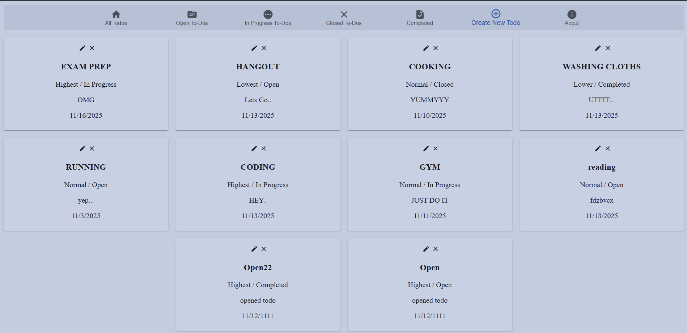

# React Todos App

.png>)
   
A simple, efficient Todo app built with React, Redux Toolkit, React Router, and Material-UI (MUI). Includes responsive UI, robust state management, and a ready-to-run JSON-server API for quick development and testing.

---
##  Tech Stack

  - React
  - Redux Toolkit
  - React Router
  - Material-UI (MUI)
  - JSON-server (API)
 

